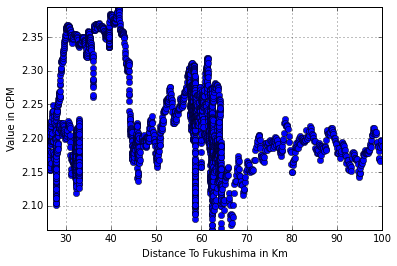

# Fukushima: One year after.

    import os
    import pandas as pd
    import numpy as np
    import matplotlib.pyplot as plt
    import matplotlib as mpl
    from scipy import stats
    import statsmodels.api as sm
    import scipy, scipy.stats
    from sklearn.cluster import KMeans

The dataset was loaded using python pandas. Since this is a large file,
instead of reading the whole file into memory, we specify a chunk size,
and return an object over which we can iterate.
For each chunk, we select the rows where the dates are in March 2012.
Afterwards, the chunks are concatenated into a Data Frame.

I found the latitude and longitude of Fukushima Nuclear, and wrote a python
function to calculate the distance in km between two pairs coordinate points. A
new column is added to the Data Frame, “Distance to Fukushima in km”. Based on
this column, we further filter the data and only retain measurements taken up to
100 km from the plant. This yields about half a million observations.

    def getData(original_filename, modified_filename):
    
        if os.path.isfile(modified_filename):
    
            df = pd.read_csv(modified_filename)
    
        else:
            reader = pd.read_csv(original_filename , iterator = True, chunksize = 10000)
    
            # Filter for all the readings between dates 03-01-2012 to 03-31-2012.
            # Set Captured time as index
            reader = [chunk[(chunk['Captured Time']>'2012-03-01') & (chunk['Captured Time']<'2012-03-31')] for chunk in reader]
    
            df = pd.concat(reader)
    
            # Filter for all the readings from within 100 km of the Fukushima Diaichi Nuclear plant
            df['Distance To Fukushima in Km'] = df.apply( distanceToF, axis = 1)
            df = df[df['Distance To Fukushima in Km'] <= 100]
    
            # Write to csv file
            df.to_csv(modified_filename)
    
        return df
    
    def distanceToF(x):
    
        R = 6373.0 # Earth's radius in Km
        lat_Fukishima = np.radians(37.421003)
        lon_Fukishima = np.radians(141.033206)
    
        lat = np.radians(x['Latitude'])
        lon = np.radians(x['Longitude'])
    
        dist_lon = lon - lon_Fukishima
        dist_lat = lat - lat_Fukishima
    
        a = (np.sin( dist_lat / 2)) ** 2 + np.cos( lat) * np.cos( lat_Fukishima) * ( np.sin( dist_lon / 2)) ** 2
        c = 2 * np.arctan2( np.sqrt( a), np.sqrt( 1 - a))
        distance = R * c # result in kilometers
        return distance
    
    
    def Fstat_pval(y,y_hat):
        dfn = 1
        dfd = len(y) - dfn - 1
        MSM = (1/dfn) * (y - y.mean()).sum()
        MSE = (1/dfd) * (y - y_hat).sum()
        F = MSM / MSE
        p = 1.0 - scipy.stats.f.cdf(F,dfn,dfd)
        return p

Loading the data. We only process the whole dataset once. The smaller csv file
is saved (~10 MB).

    
    # Load data for large files
    original_filename =  "/Users/" + os.getlogin() + "/Desktop/measurements.csv"
    modified_filename =  "/Users/" + os.getlogin() + "/Desktop/measurements_modified.csv"
    
    df = getData(original_filename, modified_filename)
    df = df.set_index('Captured Time')
    
    # Show head of data frame
    df.head()

<table border="1" class="dataframe">
  <thead>
    <tr style="text-align: right;">
      <th></th>
      <th>Unnamed: 0</th>
      <th>Latitude</th>
      <th>Longitude</th>
      <th>Value</th>
      <th>Unit</th>
      <th>Location Name</th>
      <th>Device ID</th>
      <th>MD5Sum</th>
      <th>Height</th>
      <th>Surface</th>
      <th>Radiation</th>
      <th>Uploaded Time</th>
      <th>Loader ID</th>
      <th>Distance To Fukushima in Km</th>
    </tr>
    <tr>
      <th>Captured Time</th>
      <th></th>
      <th></th>
      <th></th>
      <th></th>
      <th></th>
      <th></th>
      <th></th>
      <th></th>
      <th></th>
      <th></th>
      <th></th>
      <th></th>
      <th></th>
      <th></th>
    </tr>
  </thead>
  <tbody>
    <tr>
      <th>2012-03-16 05:49:41</th>
      <td> 4091</td>
      <td> 37.62881</td>
      <td> 140.939337</td>
      <td> 206</td>
      <td> cpm</td>
      <td>NaN</td>
      <td>NaN</td>
      <td> 1acfbf4ef61b4731c402358083746ee0</td>
      <td>NaN</td>
      <td>NaN</td>
      <td>NaN</td>
      <td> 2013-05-24 11:36:45.365055</td>
      <td> 12775</td>
      <td> 24.552847</td>
    </tr>
    <tr>
      <th>2012-03-16 05:49:46</th>
      <td> 4092</td>
      <td> 37.62881</td>
      <td> 140.939337</td>
      <td> 201</td>
      <td> cpm</td>
      <td>NaN</td>
      <td>NaN</td>
      <td> d0d7d64678e81876a6c3e31c21da6063</td>
      <td>NaN</td>
      <td>NaN</td>
      <td>NaN</td>
      <td> 2013-05-24 11:36:45.365055</td>
      <td> 12775</td>
      <td> 24.552847</td>
    </tr>
    <tr>
      <th>2012-03-16 05:49:51</th>
      <td> 4093</td>
      <td> 37.62881</td>
      <td> 140.939337</td>
      <td> 210</td>
      <td> cpm</td>
      <td>NaN</td>
      <td>NaN</td>
      <td> 2a652c9a814f2ca76bb2c3f32796ca43</td>
      <td>NaN</td>
      <td>NaN</td>
      <td>NaN</td>
      <td> 2013-05-24 11:36:45.365055</td>
      <td> 12775</td>
      <td> 24.552847</td>
    </tr>
    <tr>
      <th>2012-03-16 05:49:56</th>
      <td> 4094</td>
      <td> 37.62881</td>
      <td> 140.939337</td>
      <td> 216</td>
      <td> cpm</td>
      <td>NaN</td>
      <td>NaN</td>
      <td> 3112174eb93a9e001afa22616522852a</td>
      <td>NaN</td>
      <td>NaN</td>
      <td>NaN</td>
      <td> 2013-05-24 11:36:45.365055</td>
      <td> 12775</td>
      <td> 24.552847</td>
    </tr>
    <tr>
      <th>2012-03-16 05:50:01</th>
      <td> 4095</td>
      <td> 37.62881</td>
      <td> 140.939337</td>
      <td> 207</td>
      <td> cpm</td>
      <td>NaN</td>
      <td>NaN</td>
      <td> c766842ce0169d05394e98ebb7d3a554</td>
      <td>NaN</td>
      <td>NaN</td>
      <td>NaN</td>
      <td> 2013-05-24 11:36:45.365055</td>
      <td> 12775</td>
      <td> 24.552847</td>
    </tr>
  </tbody>
</table>

Now, a bit about the data itself: There is one column called Loader ID. Data was
collected by giving radioactivity measuring devices to volunteers. Volunteers
would upload their radioactivity measurements, as well as the latitude and
longitude of where the measurement was taken, and a timestamp, amongst other
information.

## Finding Loader ID outliers

Now, we go about finding outlying Loader ID’s. Since, for each Loader ID, the
times and locations of where the data were collected vary, aggregating all the
data and doing a distribution estimation, in order to find outliers, would not
be the best approach. For example, if one Loader ID was used to take just a few
measurements, but very close to the nuclear plant, this first approach might
consider this Loader ID an outlier, which is clearly misleading.

One could think that, the closer to the plant the measurement was taken, the
higher the measurement should be - provided measurements are taken at around the
same time. Moreover, all Loader ID’s should follow a similar relationship
between level of radioactivity detected and distance from the plant. One way of
defining an “outlying” Loader ID is if its measurements differ significantly
from the distance to the plant vs radiation relationship learned from the data
from all Loader ID’s.

I aggregated the measurements from all the Loader IDs and plotted the
radioactivity measurement against the distance to the plant. I confirmed that
the only unit used for the measurements is cpm - counts per minute.

    %matplotlib inline
    
    plt.figure()
    df.plot( x = 'Distance To Fukushima in Km', y = 'Value', style = 'o', label='All loaders')
    plt.xlabel( 'Distance To Fukushima in Km' )
    plt.ylabel( 'Value in CPM' )
    plt.axis( 'tight' )
    plt.show()

There is a sharp decrease in the radiation levels as the distance from the plant
increases. Before doing ordinary least squares, we perform a box cox transform
and then do our regression analysis.

    
    # Box Cox transform on the data
    df['Value transf'], lambd = stats.boxcox(df['Value'])
    
    # Check that there is only one radioactivity measure unit
    print(pd.unique(df.Unit.ravel()))
    
    # Make plots, using the box-cox transformed data
    plt.figure()
    df.plot( x = 'Distance To Fukushima in Km', y = 'Value transf', style = 'o', label='All loaders')
    plt.xlabel( 'Distance To Fukushima in Km' )
    plt.ylabel( 'Value in CPM (box cox transform)' )
    plt.axis( 'tight' )
    
    # OLS fit for radiation level as a function of distance from the plant
    X = df[ 'Distance To Fukushima in Km']
    X = sm.add_constant(X)
    y = df['Value transf']
    model = sm.OLS( y , X)
    result = model.fit()
    
    # Print summary of OLS fit
    print(result.summary())
    
    # Plot regression line
    y_hat = result.predict(X)
    plt.plot(X, y_hat, 'r', alpha=0.9)
    plt.show()

    ['cpm']
                                OLS Regression Results                            
    ==============================================================================
    Dep. Variable:           Value transf   R-squared:                       0.360
    Model:                            OLS   Adj. R-squared:                  0.360
    Method:                 Least Squares   F-statistic:                 3.922e+04
    Date:                Tue, 18 Nov 2014   Prob (F-statistic):               0.00
    Time:                        15:55:56   Log-Likelihood:                 64148.
    No. Observations:               69662   AIC:                        -1.283e+05
    Df Residuals:                   69660   BIC:                        -1.283e+05
    Df Model:                           1                                         
    Covariance Type:            nonrobust                                         
    ===============================================================================================
                                      coef    std err          t      P>|t|      [95.0% Conf. Int.]
    -----------------------------------------------------------------------------------------------
    const                           2.3020      0.001   3056.154      0.000         2.301     2.303
    Distance To Fukushima in Km    -0.0031   1.56e-05   -198.045      0.000        -0.003    -0.003
    ==============================================================================
    Omnibus:                      117.496   Durbin-Watson:                   0.455
    Prob(Omnibus):                  0.000   Jarque-Bera (JB):              118.188
    Skew:                          -0.098   Prob(JB):                     2.17e-26
    Kurtosis:                       3.044   Cond. No.                         99.6
    ==============================================================================
    
    Warnings:
    [1] Standard Errors assume that the covariance matrix of the errors is correctly specified.

Now, to find outlying Loader ID’s, we will see how well the model from the
aggregated data fits the data from each model. The F-statistic is computed using
the respective degrees of freedom for each group. Now, after we have selected a
statistical significance level (alpha = 0.05), we can decide whether a Loader ID
is an outlier or not based on the OLS fit. We also plot the data from the
outlying Loader ID's, to visually understand what is happening. We can see that,
for these Loader ID's, the radioactivity level doesn't seem to be a decreasing
function of the distance to the plant.

    # Check which Loader IDs have values that don't fit the model well
    alpha = 0.05
    group_Loader_ID = df.groupby('Loader ID')
    list_outliers_Loader_ID = []
    
    # Loop over each group
    for key , gp in group_Loader_ID:
    
        # Compute p value for how the model computed in total dataset fits this group
        gp = gp.sort('Distance To Fukushima in Km')
        X = gp['Distance To Fukushima in Km']
        X = sm.add_constant(X)
        y = gp['Value transf']
        y_hat = result.predict(X)
        p_value = Fstat_pval(y,y_hat)
    
        if p_value > alpha:
    
            list_outliers_Loader_ID.append(key)
    
            # Plot data for outlier Loader IDs to visually inspect our results
            plt.figure()
            gp.plot( x = 'Distance To Fukushima in Km', y = 'Value transf', style = 'o', label='Loader ID %s, p_val = %f' % (key,p_value))
            plt.xlabel('Distance To Fukushima in Km')
            plt.ylabel('Value in CPM')
            plt.axis('tight')
            plt.show()
    

    print("This is the list of outlier Loader ID's:")
    print(list_outliers_Loader_ID)

    This is the list of outlier Loader ID's:
    [591.0, 593.0, 608.0, 611.0, 614.0, 624.0, 625.0, 628.0, 630.0, 633.0, 644.0, 654.0, 655.0, 656.0, 659.0, 673.0, 674.0, 697.0, 11473.0, 12775.0]

Splitting by Loader ID is not the best idea, since each one contains
measurements from various geographical locations, often only a handful of
observations per location. In Safecast webpage, it’s observed radiation levels
can vary a lot by taking the measurements only meters apart.

One way of organizing the data is by dividing it in ring-shaped geographical
regions, with the plant being the center. The boundries for the regions should
be data-driven. I am doing K-means clustering on the data, considering the
radiation level, and distance to the plant. The idea is to find rings around the
nuclear plant, such that the measurements in that ring are comparable. I am
choosing 10 clusters.

Some possible disadvantages of my approach are: I’m not considering how
different devices might have been calibrated differently - I am assuming they
are all somewhat similarly calibrated. Another disadvantage is that I am
assuming radiation decreases as a function of distance from the plant, when in
fact other factors can come into play.

    # Perform kmeans clustering
    data_for_cluster = df[['Distance To Fukushima in Km', 'Value transf']]
    data_for_cluster = np.asarray(data_for_cluster)
    kmeans = KMeans(init = 'k-means++' , n_clusters = 10 , n_init = 10)
    kmeans.fit(data_for_cluster)
    

    KMeans(copy_x=True, init='k-means++', max_iter=300, n_clusters=10, n_init=10,
        n_jobs=1, precompute_distances=True, random_state=None, tol=0.0001,
        verbose=0)

    
    # Plot the decision boundary of the clusters. Create a mesh
    x_min, x_max = data_for_cluster[:, 0].min() , data_for_cluster[:, 0].max()
    y_min, y_max = data_for_cluster[:, 1].min() , data_for_cluster[:, 1].max()
    xx, yy = np.meshgrid(np.arange(x_min, x_max, 1), np.arange(y_min, y_max, 0.05))
    
    # Get labels for points in mesh
    Z = kmeans.predict(np.c_[xx.ravel(), yy.ravel()])
    Z = Z.reshape(xx.shape)
    
    # Plot mesh
    plt.figure()
    plt.imshow( Z, interpolation = 'nearest', extent = (x_min, x_max, y_min, y_max),
               cmap = plt.cm.Paired, aspect = 'auto', origin = 'lower')
    plt.plot(data_for_cluster[:, 0], data_for_cluster[:, 1], 'k.', markersize = 2)
    
    # Plot the centroids
    centroids = kmeans.cluster_centers_
    plt.scatter(centroids[:, 0], centroids[:, 1], marker = 'x',
                linewidths = 5, color = 'y', zorder = 10)
    
    plt.title('K-means clustering on the dataset')
    plt.xlim(x_min, x_max)
    plt.ylim(y_min, y_max)
    plt.show()

Once the ten clusters have been identified, I plot a time series for all the
measurements in each cluster, and their histograms. Under this regime, it makes
more sense to do smoothing in the time series by combining temporally adjacent
points, since they will be spatially adjacent too. This analysis is done using
the raw radiation values, instead of the box cox transformed ones.

    # Add kmeans labels as a column to data frame. Since labels are assigned randomly, 
    # we re-name the labels so that Region 0 is the closest one to the plant, followed by Region 1, etc.
    
    df['Cluster Labels'] = kmeans.labels_
    
    centroids_x_axis = centroids[:, 0]
    sort_index = np.argsort(centroids_x_axis)
    for label in range(0,10):
        df.loc[df['Cluster Labels']==label, 'Cluster Labels'] = 'Region %s' % sort_index[label]
    
    for label in range(0,10):
    
        ts = df[ df['Cluster Labels'] == 'Region %s' %label]['Value']
        ts = ts.sort_index()
    
        plt.figure()
        ts.plot()
        pd.rolling_mean(ts, 100).plot(style = 'k--', linewidth = 5)
        locs, labels = plt.xticks()
        plt.setp(labels, rotation=30)
        plt.title('Time series for Region %s'%label)
        
        plt.figure()
        ts.hist()
        plt.title('Histogram for Region %s'%label)

## Conclusion and next steps

We have the plots for the time series and histograms for each cluster.

Even after using different sized smoothing windows, a decreasing trend in time
across all clusters is not visible. It would be interesting to plot radiation
levels for these clusters in longer periods of time to see if we detect a
decreasing trend.

The histograms do show a different frequencies in different values, as we get
away form the plant. Region 3 has a set of very high values, and a bimodal
distribution should appear in the histogram with better binning. A bimodal
distribution is seen in Region 4 as well. To test that histograms have different
values, I would do an ANOVA test.

My next step would be to look at longer trends in time. I would look at
radiation levels before the nuclear plant disaster, and would find the
distribution of these values for different regions. For each region, I would get
the radiation levels after the disaster, and, for every month after the
disaster, I would compute the likelihood of that month's measurements being
generated by the pre-disaster distribution. The interesting thing to do next
would be which regions have returned to pre-disaster levels of radioactivity,
and which ones have not.

    
